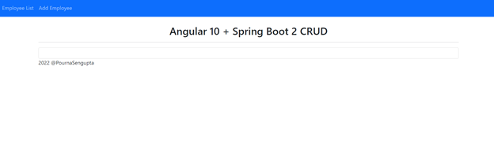
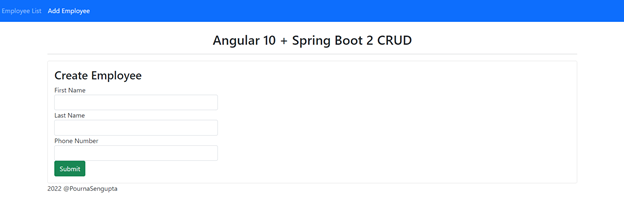
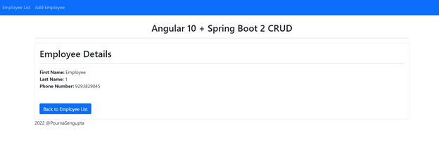
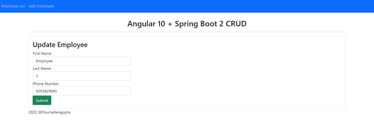
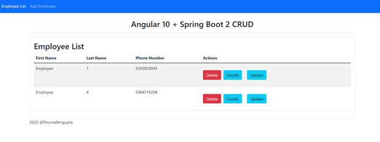

# Spring Boot and Angular 10 CRUD Tutorial 

 ## Overview 
> In this tutorial, a CRUD (Create, Read, Update, and Delete) application using Spring Boot, Angular, and MySQL is created for an Employee Management system. 
> This system tracks Employee Name and Phone Number, but can easily be modified for further components. 
> 
> The full tutorial can be found [here](./AngularSpringBootTraining.pdf)

## Features 
> * Create an Employee 
> * Update an Employee 
> * List Employees 
> * Delete an Employee 
> * View an Employee

##Client and Server 
> The [springboot2-jpa-crud](https://github.com/Sengupta-Accenture/SpringBoot-CRUD) directory develops the CRUD RESTful APIs for the Employee Management System using Spring Boot 2, JPA, and MySQL. 
> The [angular10-client](https://github.com/Sengupta-Accenture/Angular10-CRUD) directory develops the single page application, using Angular 10 for front end development in this example. This application consumes the CRUD RESTful APIs developed and exposed by the springboot2-jpa-crud project. 

## Tools and Technologies 
> * Spring Boot 
> * JDK 
> * Spring Framework 
> * Hibernate
> * Spring Data JPA

> ### Database 
> MySQL Database 

> ### Front End Technologies 
> * Angular 10
> * Bootstrap 
> * NPM 
> * jQuery 
> * NodeJS

### Tools
> * Maven 
> * IDE - IntelliJ (Spring Boot API)
> * Visual Studio (Angular Application)
> * Angular CLI 10 

## File Directory 
> ### Angular 10 Client 
> #### Application Files 
>> * [angular.json](./angular.json)
>> * [index.html](./src/index.html)
>> * [main.ts](./src/main.ts)
>> * [polyfills.ts](./src/polyfills.ts)
>> * [package.json](./package.json)

> #### Employee Object
>> * [Employee Object](./src/app/employee.ts)

> #### Employee Service 
>> * [Employee Service](./src/app/employee.service.ts)

> #### Create Employee
>> [Create Employee Component](./src/app/create-employee)
>> * [create-employee.component.ts](./src/app/create-employee/create-employee.component.ts)
>> * [create-employee.component.html](./src/app/create-employee/create-employee.component.html)

> #### Employee Details 
>> [Employee-Details Component](./src/app/employee-details)
>> * [employee-details.component.ts](./src/app/employee-details/employee-details.component.ts)
>> * [employee-details.component.html](./src/app/employee-details/employee-details.component.html)

> #### Employee List 
>> [Employee-List Component](./src/app/employee-list)
>> * [employee-list.component.ts](./src/app/employee-list/employee-list.component.ts)
>> * [employee-list.component.html](./src/app/employee-list/employee-list.component.html)

> #### Update Employee 
>> [Update Employee Component](./src/app/update-employee)
>> * [update-employee.component.ts](./src/app/update-employee/update-employee.component.ts)
>> * [update-employee.component.html](./src/app/update-employee/update-employee.component.html)

> #### Application Routing 
>> * [app-routing.module.ts](./src/app/app-routing.module.ts)

> #### Application Root Component
>> * [app.component.ts](./src/app/app.component.ts)
>> * [app.component.html](./src/app/app.component.html)

> ## Employee Management System 
> ### Home Page
> 
> ### Create
> 
> ### Read
> 
> ### Update
> 
> ### Delete
> 
